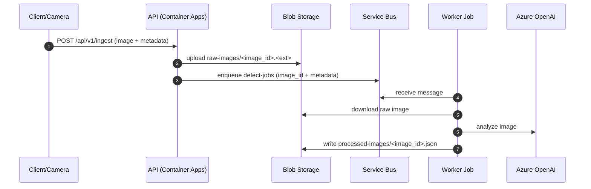

# Wiko Defect Analyzer - Azure Architecture

## Architecture overview
This system is an Azure-native ingestion + processing pipeline for visual defect analysis. The API handles uploads and queueing; the worker performs AI analysis and writes processed artifacts to Blob Storage.

## Components
- **API (Azure Container Apps)**: `/api/v1/ingest` writes raw images to Blob Storage and enqueues messages to Service Bus.
- **Azure Blob Storage**: `raw-images` container for source images; `processed-images` container for processed JSON artifacts.
- **Azure Service Bus**: `defect-jobs` queue driving async processing.
- **Worker (Azure Container Apps Job)**: event-driven job that consumes queue messages, runs analysis, and writes JSON.
- **Azure OpenAI**: GPT-5.2 deployments for vision/classification/reasoning.

## Data flow


## Processing contract
Service Bus message payload (JSON):
```json
{
  "image_id": "uuid",
  "blob_name": "uuid.jpg",
  "raw_container": "raw-images",
  "processed_container": "processed-images",
  "product_sku": "WK-KN-200",
  "facility": "yangjiang",
  "received_at": "ISO-8601",
  "content_type": "image/jpeg",
  "metadata": {}
}
```

Processed JSON output is stored as:
`processed-images/<image_id>.json`

## Operational concerns
- **Idempotency**: Worker skips processing if the processed blob already exists.
- **DLQ**: Dead-letters messages after the configured delivery attempt threshold.
- **Auth**: Managed identity for Storage, Service Bus, and Azure OpenAI; API keys only for local dev.
- **Observability**: App Insights for API + worker, queue depth alerts, DLQ alerts.
