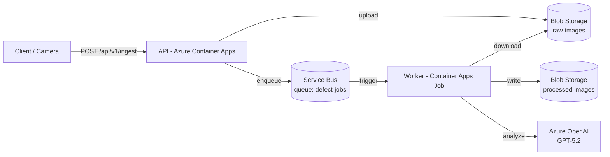

# Wiko Defect Analyzer - Production Briefing

## Executive summary
The system is now aligned to the intended Azure-native pipeline: the API ingests images, writes them to Blob Storage, enqueues Service Bus messages, and the worker job processes each image into a deterministic JSON artifact in `processed-images/<image_id>.json`. Managed identity auth is supported for both Azure OpenAI and platform services, with API keys reserved for local development.

## Current status
What works:
- API `/api/v1/ingest` accepts images, validates payloads, writes raw blobs, and enqueues queue messages.
- Worker consumes queue messages, analyzes images via Azure OpenAI, and writes deterministic processed JSON.
- Managed identity auth for OpenAI is supported when `AZURE_AI_API_KEY` is absent.

Remaining gaps:
- Confirm RBAC is granted for the API and worker managed identities (Storage Blob Data Contributor + Service Bus Data Sender/Receiver).
- Verify DLQ handling and alerting on poison messages.
- Add monitoring dashboards (App Insights + log-based alerts).
- Validate idempotency at scale and confirm duplicate detection on the Service Bus queue.

## Detailed architecture
Components:
- **API (Azure Container Apps)**: `/api/v1/ingest` uploads raw images to Blob Storage and enqueues a Service Bus message.
- **Azure Blob Storage**: `raw-images/` for source images; `processed-images/` for processed JSON artifacts.
- **Azure Service Bus**: `defect-jobs` queue coordinates async processing.
- **Worker (Azure Container Apps Job)**: dequeues messages, runs analysis, and writes processed JSON.
- **Azure OpenAI**: GPT-5.2 deployments for vision/classification/reasoning.

Data flow:
1. Client uploads image + metadata to `/api/v1/ingest`.
2. API stores `raw-images/<image_id>.<ext>` and enqueues a JSON message with metadata.
3. Worker receives message, downloads image, runs analysis, and writes `processed-images/<image_id>.json`.
4. Downstream apps can read processed JSON deterministically by `image_id`.

## Architecture diagram


## Environment variables (standardized)
API and worker share the same Azure platform variables. API adds web-specific settings.

Azure OpenAI:
- `AZURE_AI_PROJECT_ENDPOINT` (required)
- `AZURE_OPENAI_API_VERSION` (default `2025-04-01-preview`)
- `AZURE_AI_API_KEY` (local dev only; omit in production)
- `AZURE_OPENAI_TOKEN_SCOPE` (optional; default `https://cognitiveservices.azure.com/.default`)
- `AZURE_VISION_DEPLOYMENT` (default `gpt-5-2`)
- `AZURE_REASONING_DEPLOYMENT` (default `gpt-5-2`)
- `AZURE_REPORTS_DEPLOYMENT` (default `gpt-5-2-chat`)

Storage:
- `AZURE_STORAGE_ACCOUNT` (required if no connection string)
- `AZURE_STORAGE_CONNECTION_STRING` (local dev)
- `AZURE_STORAGE_RAW_CONTAINER` (default `raw-images`)
- `AZURE_STORAGE_PROCESSED_CONTAINER` (default `processed-images`)

Service Bus:
- `AZURE_SERVICEBUS_NAMESPACE` (required if no connection string)
- `AZURE_SERVICEBUS_CONNECTION_STRING` (local dev)
- `AZURE_SERVICEBUS_QUEUE` (default `defect-jobs`)

Worker:
- `WORKER_MAX_MESSAGES` (default `10`)
- `WORKER_MAX_DELIVERY_ATTEMPTS` (default `5`)

API:
- `API_KEY` (required in production)
- `CORS_ORIGINS`
- `RATE_LIMIT_PER_IP`, `RATE_LIMIT_PER_KEY`
- `LOG_LEVEL`

## Processed JSON schema (minimum)
Stored at `processed-images/<image_id>.json`:
```json
{
  "image_id": "uuid",
  "timestamps": {
    "ingested_at": "ISO-8601",
    "processed_at": "ISO-8601"
  },
  "metadata": {
    "product_sku": "WK-KN-200",
    "facility": "yangjiang",
    "source_blob": {
      "container": "raw-images",
      "blob_name": "uuid.jpg"
    },
    "content_type": "image/jpeg",
    "extra": {}
  },
  "defect_findings": {
    "defect_detected": true,
    "defect_type": "edge_irregularity",
    "severity": "minor",
    "description": "Slight waviness detected on cutting edge",
    "confidence": 0.92,
    "bounding_boxes": [
      { "x": 12, "y": 48, "width": 120, "height": 80 }
    ]
  },
  "model_version": "gpt-5.2"
}
```

## Production readiness checklist
- [ ] RBAC: API and worker identities have `Storage Blob Data Contributor` and Service Bus `Data Sender/Receiver`.
- [ ] Auth: API enforces `API_KEY` and CORS is locked to prod domains.
- [ ] DLQ: Queue has DLQ enabled; worker dead-letters after max attempts.
- [ ] Idempotency: Duplicate detection enabled on queue; worker skips existing processed blob.
- [ ] Monitoring: App Insights enabled for API + worker; log-based alerts on failures.
- [ ] Backpressure: Worker max messages tuned for queue volume and model latency.

## How to run in production (Azure CLI)
```bash
# Resource group + Container Apps environment
az group create -n rg-defectiq-prod -l eastus2
az monitor log-analytics workspace create -g rg-defectiq-prod -n law-defectiq-prod
LAW_ID=$(az monitor log-analytics workspace show -g rg-defectiq-prod -n law-defectiq-prod --query customerId -o tsv)
LAW_KEY=$(az monitor log-analytics workspace get-shared-keys -g rg-defectiq-prod -n law-defectiq-prod --query primarySharedKey -o tsv)
az containerapp env create -g rg-defectiq-prod -n cae-defectiq-prod -l eastus2 \
  --logs-workspace-id "$LAW_ID" --logs-workspace-key "$LAW_KEY"

# Storage + Service Bus (use your existing names if already created)
az storage account create -g rg-defectiq-prod -n defectiq4852854 -l eastus2 --sku Standard_LRS
az storage container create --account-name defectiq4852854 --name raw-images --auth-mode login
az storage container create --account-name defectiq4852854 --name processed-images --auth-mode login
az servicebus namespace create -g rg-defectiq-prod -n defectiq-sb-96027 -l eastus2 --sku Standard
az servicebus queue create -g rg-defectiq-prod --namespace-name defectiq-sb-96027 -n defect-jobs \
  --enable-duplicate-detection true --duplicate-detection-history-time-window PT10M

# API (Container Apps)
az containerapp create -g rg-defectiq-prod -n defectiq-api \
  --environment cae-defectiq-prod \
  --image defectiqacr1018510520.azurecr.io/defectiq-api:latest \
  --registry-server defectiqacr1018510520.azurecr.io \
  --ingress external --target-port 5001 \
  --env-vars \
    AZURE_AI_PROJECT_ENDPOINT=$AZURE_AI_PROJECT_ENDPOINT \
    AZURE_VISION_DEPLOYMENT=gpt-5-2 \
    AZURE_REASONING_DEPLOYMENT=gpt-5-2 \
    AZURE_REPORTS_DEPLOYMENT=gpt-5-2-chat \
    AZURE_STORAGE_ACCOUNT=defectiq4852854 \
    AZURE_STORAGE_RAW_CONTAINER=raw-images \
    AZURE_STORAGE_PROCESSED_CONTAINER=processed-images \
    AZURE_SERVICEBUS_NAMESPACE=defectiq-sb-96027 \
    AZURE_SERVICEBUS_QUEUE=defect-jobs \
    API_KEY=$API_KEY \
    CORS_ORIGINS=https://your-frontend.example.com \
    LOG_LEVEL=INFO

# Worker (Container Apps Job, event-driven)
az containerapp job create -g rg-defectiq-prod -n defectiq-worker \
  --environment cae-defectiq-prod \
  --trigger-type Event \
  --replica-timeout 1800 \
  --replica-retry-limit 1 \
  --image defectiqacr1018510520.azurecr.io/defectiq-worker:latest \
  --registry-server defectiqacr1018510520.azurecr.io \
  --min-executions 0 --max-executions 10 \
  --polling-interval 30 \
  --env-vars \
    AZURE_AI_PROJECT_ENDPOINT=$AZURE_AI_PROJECT_ENDPOINT \
    AZURE_VISION_DEPLOYMENT=gpt-5-2 \
    AZURE_REASONING_DEPLOYMENT=gpt-5-2 \
    AZURE_REPORTS_DEPLOYMENT=gpt-5-2-chat \
    AZURE_STORAGE_ACCOUNT=defectiq4852854 \
    AZURE_STORAGE_RAW_CONTAINER=raw-images \
    AZURE_STORAGE_PROCESSED_CONTAINER=processed-images \
    AZURE_SERVICEBUS_NAMESPACE=defectiq-sb-96027 \
    AZURE_SERVICEBUS_QUEUE=defect-jobs \
    WORKER_MAX_MESSAGES=10 \
    WORKER_MAX_DELIVERY_ATTEMPTS=5 \
    LOG_LEVEL=INFO \
  --scale-rule-name sb-queue \
  --scale-rule-type azure-servicebus \
  --scale-rule-metadata queueName=defect-jobs namespace=defectiq-sb-96027 \
  --scale-rule-auth connection=AZURE_SERVICEBUS_CONNECTION_STRING
```

Debugging commands:
```bash
# API logs
az containerapp logs show -g rg-defectiq-prod -n defectiq-api --tail 200

# Worker executions + logs
az containerapp job execution list -g rg-defectiq-prod -n defectiq-worker -o table
EXECUTION=$(az containerapp job execution list -g rg-defectiq-prod -n defectiq-worker --query "[0].name" -o tsv)
az containerapp job execution logs show -g rg-defectiq-prod -n defectiq-worker --execution "$EXECUTION" --tail 200

# Queue depth + DLQ
az servicebus queue show -g rg-defectiq-prod --namespace-name defectiq-sb-96027 -n defect-jobs \
  --query "countDetails" -o json

# Processed output check
az storage blob list --account-name defectiq4852854 --container-name processed-images --auth-mode login -o table
```
